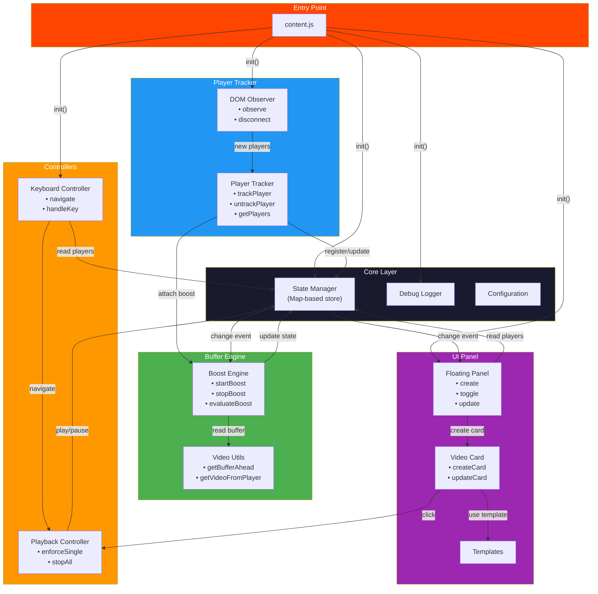

# Reddit Video Extension - Feature Summary & Refactoring Plan

## 📊 Current Feature Analysis

### Existing Features

```
┌─────────────────────────────────────────────────────────────────┐
│                    REDDIT VIDEO EXTENSION                       │
├───────────────┬─────────────────────────────────────────────────┤
│ Buffer Boost  │ • Monitors video buffer ahead                   │
│ Engine        │ • Applies playback rate boost when buffer is low │
│               │ • Special boost on seek (1.5x rate)             │
│               │ • Tab visibility aware                         │
│               │ • Auto-cleanup on video removal                │
├───────────────┤─────────────────────────────────────────────────┤
│ Video Tracker │ • Tracks shreddit-player elements in DOM       │
│               │ • Maps players → entries (not video → entry)   │
│               │ • Shadow DOM aware for video access            │
│               │ • MutationObserver for new player detection    │
├───────────────┤─────────────────────────────────────────────────┤
│ Floating Panel│ • Draggable panel overlay                      │
│               │ • Video cards with previews                    │
│               │ • Live status updates (playing/paused)         │
│               │ • Boost indicator display                     │
│               │ • Videos/Logs tabs                            │
│               │ • Collapsible panel                           │
├───────────────┤─────────────────────────────────────────────────┤
│ Playback      │ • Single video playback enforcement            │
│ Controller    │ • Keyboard navigation (arrows)                 │
│               │ • Click-to-play from panel                    │
│               │ • Scroll-to-video on panel click              │
│               │ • Auto-pause on tab hide                      │
├───────────────┤─────────────────────────────────────────────────┤
│ Debug Logging │ • Color-coded log levels                      │
│               │ • Timestamped entries                         │
│               │ • Toggleable debug mode                       │
└───────────────┴─────────────────────────────────────────────────┘
```

### 🔍 Identified Issues

| #   | Issue                                                              | Location          | Severity |
| --- | ------------------------------------------------------------------ | ----------------- | -------- |
| 1   | All logic in single 500+ line file                                 | `content.js`      | Critical |
| 2   | Global mutable state (`players`, `videoCards`, `currentlyPlaying`) | Top-level         | High     |
| 3   | Mixed concerns: DOM, state, UI, boost                              | Entire file       | High     |
| 4   | No module separation or encapsulation                              | All functions     | Medium   |
| 5   | CSS class manipulation scattered                                   | Various functions | Medium   |
| 6   | Timer management is fragile                                        | `boostTimers`     | Medium   |
| 7   | No state management pattern                                        | Global vars       | Medium   |

---

## 🏗️ Proposed File Structure

```
reddit-extension/
├── manifest.json                    (unchanged API surface)
├── panel.css                        (unchanged, extracted styles)
├── content.js                       (thin entry point)
├── src/
│   ├── core/
│   │   ├── state.js                 (single source of truth)
│   │   ├── debug.js                 (logging system)
│   │   └── config.js                (BOOST_CONFIG + constants)
│   ├── engine/
│   │   ├── boost-engine.js          (buffer boost logic)
│   │   └── video-utils.js           (getBufferAhead, getVideoFromPlayer, etc.)
│   ├── tracker/
│   │   ├── player-tracker.js        (player detection & tracking)
│   │   └── dom-observer.js          (mutation observer setup)
│   ├── panel/
│   │   ├── floating-panel.js        (panel creation & management)
│   │   ├── video-card.js            (card creation & updates)
│   │   └── templates.js             (HTML templates)
│   └── controllers/
│       ├── playback-controller.js   (single playback enforcement)
│       └── keyboard-controller.js   (arrow key navigation)
```

---

## 🔄 Data Flow Diagram



---

## 📦 New File Implementations

### `src/core/debug.js`

```javascript
/**
 * Centralized debug logging system
 * Supports multiple log levels with visual indicators
 */
export const DebugLogger = (() => {
  const levels = {
    INFO: "🔵",
    SUCCESS: "🟢",
    WARN: "🟡",
    ERROR: "🔴",
    BOOST: "🚀",
    PANEL: "📊",
    DOM: "🏗️",
    CLEANUP: "🗑️",
    STATE: "📦",
  };

  let enabled = true;

  return {
    enable() {
      enabled = true;
    },
    disable() {
      enabled = false;
    },
    isEnabled() {
      return enabled;
    },

    log(level, message, data = null) {
      if (!enabled) return;
      const ts = new Date().toLocaleTimeString();
      const prefix = levels[level] || "📝";
      console.log(`${prefix} [Reddit ${ts}] ${message}`, data || "");
    },

    error(message, error) {
      this.log("ERROR", message);
      if (error) console.error(error);
    },

    group(label, fn) {
      if (!enabled) {
        fn?.();
        return;
      }
      console.group(`📦 [Reddit] ${label}`);
      fn?.();
      console.groupEnd();
    },
  };
})();
```

### `src/core/config.js`

```javascript
/**
 * All configurable constants in one place
 */
export const BOOST_CONFIG = Object.freeze({
  BUFFER_LOW: 5,
  BOOST_DURATION: 8000,
  INITIAL_BUFFER_TARGET: 12,
  SEEK_BOOST_RATE: 1.5,
  SEEK_BOOST_DURATION: 10000,
  SEEK_MIN_EFFECTIVE_RATIO: 0.6,
  SEEK_BOOST_EXTENSION: 5000,
  MAX_BOOST_EXTENSIONS: 3,
  MAX_TOTAL_BOOST_MS: 30000,
  BOOST_RATE_NORMAL: 1.08,
});

export const DOM_CONFIG = Object.freeze({
  PLAYER_SELECTOR: "shreddit-post",
  FEED_SELECTOR: "shreddit-feed",
  FALLBACK_SELECTOR: "main",
  INITIAL_SCAN_DELAY: 3000,
  DEBOUNCE_DELAY: 1000,
  PANEL_UPDATE_INTERVAL: 1000,
});

export const PANEL_CONFIG = Object.freeze({
  Z_INDEX: 2147483646,
  DEFAULT_WIDTH: 320,
  MAX_HEIGHT_VH: 80,
  MIN_HEIGHT: 100,
});
```

### `src/core/state.js`

```javascript
/**
 * Centralized state management with pub/sub pattern
 * Single source of truth for all extension state
 */
import { DebugLogger as debug } from "./debug.js";

export const AppState = (() => {
  // Private state
  const players = new Map(); // shreddit-player → PlayerEntry
  const videoCards = new Map(); // shreddit-player → card DOM
  let currentlyPlaying = null;
  let isPanelVisible = true;
  let tabIsVisible = !document.hidden;
  let videoCounter = 0;

  // Observer pattern for state changes
  const listeners = new Map();

  function notify(event, data) {
    const subs = listeners.get(event);
    if (subs) {
      subs.forEach((callback) => {
        try {
          callback(data);
        } catch (e) {
          debug.error(`Listener error for ${event}`, e);
        }
      });
    }
  }

  return {
    // --- Getters ---
    getPlayers() {
      return new Map(players);
    }, // Return copy
    getPlayerEntries() {
      return Array.from(players.entries());
    },
    getPlayerCount() {
      return players.size;
    },
    hasPlayer(player) {
      return players.has(player);
    },
    getEntry(player) {
      return players.get(player);
    },
    getCurrentlyPlaying() {
      return currentlyPlaying;
    },
    isPanelVisible() {
      return isPanelVisible;
    },
    isTabVisible() {
      return tabIsVisible;
    },
    getNextVideoId() {
      return `video-${++videoCounter}`;
    },

    // --- Setters ---
    addPlayer(player, entry) {
      players.set(player, entry);
      debug.log("STATE", `Added: ${entry.id} | Total: ${players.size}`);
      notify("player:added", { player, entry });
      notify("players:changed", { count: players.size, action: "add" });
    },

    removePlayer(player) {
      const entry = players.get(player);
      players.delete(player);
      if (entry) {
        debug.log("STATE", `Removed: ${entry.id} | Total: ${players.size}`);
        notify("player:removed", { player, entry });
      }
      notify("players:changed", { count: players.size, action: "remove" });
      return entry;
    },

    updateEntry(player, updates) {
      const entry = players.get(player);
      if (entry) {
        Object.assign(entry, updates);
        notify("player:updated", { player, entry });
      }
    },

    setCurrentlyPlaying(video) {
      currentlyPlaying = video;
      notify("playback:changed", { video });
    },

    togglePanel() {
      isPanelVisible = !isPanelVisible;
      notify("panel:visibility", { visible: isPanelVisible });
    },

    setTabVisible(visible) {
      tabIsVisible = visible;
      notify("tab:visibility", { visible });
    },

    // --- Card Management ---
    getCard(player) {
      return videoCards.get(player);
    },
    setCard(player, card) {
      videoCards.set(player, card);
    },
    removeCard(player) {
      const card = videoCards.get(player);
      videoCards.delete(player);
      return card;
    },

    // --- Subscriptions ---
    on(event, callback) {
      if (!listeners.has(event)) listeners.set(event, new Set());
      listeners.get(event).add(callback);
      return () => listeners.get(event)?.delete(callback); // unsubscribe fn
    },

    /** Clear all state (for testing/cleanup) */
    reset() {
      players.clear();
      videoCards.clear();
      currentlyPlaying = null;
      videoCounter = 0;
    },
  };
})();
```

### `src/engine/video-utils.js`

```javascript
/**
 * Video DOM utility functions
 * Shadow DOM-aware helpers for accessing Reddit video elements
 */
export function getVideoFromPlayer(player) {
  if (!player) return null;
  if (player.shadowRoot) {
    return player.shadowRoot.querySelector("video");
  }
  return player.querySelector("video");
}

export function getPlayerId(player) {
  const post = player.closest("shreddit-post");
  if (post) {
    return post.getAttribute("post-id") || post.id || `player-unknown`;
  }
  return player.id || `player-unknown`;
}

export function getBufferAhead(video) {
  if (!video?.buffered?.length) return 0;
  const ahead =
    video.buffered.end(video.buffered.length - 1) - video.currentTime;
  return Math.max(0, ahead);
}

export function getEffectiveBufferRatio(video) {
  if (!video?.buffered?.length) return 0;
  let totalBuffered = 0;
  for (let i = 0; i < video.buffered.length; i++) {
    totalBuffered += video.buffered.end(i) - video.buffered.start(i);
  }
  const ahead = getBufferAhead(video);
  return totalBuffered > 0 ? Math.min(1, ahead / totalBuffered) : 1;
}

export function getVideoInfo(video) {
  if (!video) {
    return {
      id: "no-video",
      src: "No source",
      currentTime: 0,
      duration: 0,
      paused: true,
      playbackRate: 1,
      bufferAhead: 0,
      muted: true,
      readyState: 0,
    };
  }
  return {
    id: video.dataset.videoObserverId || "unknown",
    src: video.currentSrc || video.src || "No source",
    currentTime: video.currentTime || 0,
    duration: video.duration || 0,
    paused: video.paused,
    playbackRate: video.playbackRate || 1.0,
    bufferAhead: getBufferAhead(video),
    muted: video.muted,
    readyState: video.readyState,
  };
}
```

### `src/engine/boost-engine.js`

```javascript
/**
 * Buffer Boost Engine - manages playback rate acceleration
 * for faster video buffering
 */
import { BOOST_CONFIG } from "../core/config.js";
import {
  getBufferAhead,
  getEffectiveBufferRatio,
  getVideoFromPlayer,
} from "./video-utils.js";
import { AppState } from "../core/state.js";
import { DebugLogger as debug } from "../core/debug.js";

/**
 * Manages boost state for a single video element
 */
class BoostManager {
  constructor(video) {
    this.video = video;
    this.timers = { boostTimeout: null, monitorInterval: null };
    this.state = null;
  }

  start({ rate, duration, isSeek = false } = {}) {
    const video = this.video;
    if (!video || !AppState.isTabVisible()) return;

    const effectiveRate =
      rate ||
      (isSeek ? BOOST_CONFIG.SEEK_BOOST_RATE : BOOST_CONFIG.BOOST_RATE_NORMAL);
    const effectiveDuration =
      duration ||
      (isSeek ? BOOST_CONFIG.SEEK_BOOST_DURATION : BOOST_CONFIG.BOOST_DURATION);

    // Save original rate
    if (!video.__originalPlaybackRate) {
      video.__originalPlaybackRate = video.playbackRate || 1.0;
    }

    video.__boostTargetRate = effectiveRate;
    video.playbackRate = effectiveRate;
    video.__boostStartTime = Date.now();
    video.__boostExtensionCount = 0;
    video.__boostBaseDuration = effectiveDuration;
    video.__boostState = {
      active: true,
      extensionCount: 0,
      paused: video.paused,
    };

    debug.log(
      "BOOST",
      `Boost: ${effectiveRate.toFixed(2)}x for ${effectiveDuration}ms | Buffer: ${getBufferAhead(video).toFixed(1)}s`,
    );

    this._scheduleEvaluation();
  }

  _scheduleEvaluation() {
    this.clear();
    this.timers.boostTimeout = setTimeout(
      () => this._evaluate(),
      this.video.__boostBaseDuration,
    );
  }

  _evaluate() {
    const video = this.video;
    if (!video?.__boostState?.active || !AppState.isTabVisible()) return;

    if (video.paused) {
      video.__boostState.paused = true;
      return;
    }
    video.__boostState.paused = false;

    const currentAhead = getBufferAhead(video);
    const elapsed = Date.now() - video.__boostStartTime;
    let endReason = null;

    if (currentAhead >= BOOST_CONFIG.BUFFER_LOW * 1.5) {
      endReason = "buffer healthy";
    } else if (
      video.__boostState.extensionCount >= BOOST_CONFIG.MAX_BOOST_EXTENSIONS
    ) {
      endReason = "max extensions";
    } else if (elapsed > BOOST_CONFIG.MAX_TOTAL_BOOST_MS) {
      endReason = "max time";
    } else if (
      elapsed >
      video.__boostBaseDuration +
        video.__boostState.extensionCount * BOOST_CONFIG.SEEK_BOOST_EXTENSION
    ) {
      if (
        video.__boostState.extensionCount < BOOST_CONFIG.MAX_BOOST_EXTENSIONS &&
        elapsed <= BOOST_CONFIG.MAX_TOTAL_BOOST_MS
      ) {
        video.__boostState.extensionCount++;
        this._scheduleEvaluation();
        return;
      }
      endReason = "limits reached";
    }

    if (endReason) {
      this.stop(endReason);
    } else {
      this._scheduleEvaluation();
    }
  }

  stop(reason = "manual") {
    const video = this.video;
    if (!video) return;

    const currentAhead = getBufferAhead(video);
    debug.log(
      "BOOST",
      `Boost end: ${reason} | Buffer: ${currentAhead.toFixed(1)}s`,
    );

    if (
      video.__boostTargetRate &&
      video.playbackRate === video.__boostTargetRate
    ) {
      video.playbackRate = video.__originalPlaybackRate || 1.0;
    }

    if (video.__boostState) {
      video.__boostState.active = false;
    }

    this.clear();
  }

  clear() {
    if (this.timers.boostTimeout) {
      clearTimeout(this.timers.boostTimeout);
    }
    if (this.timers.monitorInterval) {
      clearInterval(this.timers.monitorInterval);
    }
    this.timers = { boostTimeout: null, monitorInterval: null };
  }

  dispose() {
    this.stop("dispose");
    const v = this.video;
    if (v) {
      delete v.__originalPlaybackRate;
      delete v.__boostTargetRate;
      delete v.__boostStartTime;
      delete v.__boostExtensionCount;
      delete v.__boostBaseDuration;
      delete v.__boostState;
      delete v.__hasBoostedOnLoad;
    }
  }
}

// Global boost manager registry
const managers = new WeakMap();

export const BoostEngine = {
  /**
   * Attach boost capabilities to a video element
   * Returns cleanup function
   */
  attach(video) {
    if (!video || video.dataset.boostAttached === "true") return () => {};

    video.dataset.boostAttached = "true";
    const manager = new BoostManager(video);
    managers.set(video, manager);

    debug.log(
      "BOOST",
      `Attached to ${video.dataset.videoObserverId || "unknown"}`,
    );

    // Initial buffer check after load
    const initialCheck = setTimeout(() => {
      if (!AppState.isTabVisible()) return;
      const ahead = getBufferAhead(video);
      if (
        ahead < BOOST_CONFIG.INITIAL_BUFFER_TARGET &&
        !video.__hasBoostedOnLoad
      ) {
        manager.start({
          rate: BOOST_CONFIG.BOOST_RATE_NORMAL,
          duration: BOOST_CONFIG.BOOST_DURATION,
        });
        video.__hasBoostedOnLoad = true;
      }
    }, 600);

    // Event handlers
    const onSeeked = () => {
      if (!AppState.isTabVisible()) return;
      const ratio = getEffectiveBufferRatio(video);
      manager.start({
        rate: BOOST_CONFIG.SEEK_BOOST_RATE,
        duration:
          ratio < BOOST_CONFIG.SEEK_MIN_EFFECTIVE_RATIO
            ? BOOST_CONFIG.SEEK_BOOST_DURATION +
              BOOST_CONFIG.SEEK_BOOST_EXTENSION
            : BOOST_CONFIG.SEEK_BOOST_DURATION,
        isSeek: true,
      });
    };

    const onPlay = () => {
      if (video.__boostState?.active && video.__boostState.paused) {
        video.__boostState.paused = false;
      }
    };

    const onPause = () => {
      if (video.__boostState?.active) {
        video.__boostState.paused = true;
      }
    };

    video.addEventListener("seeked", onSeeked);
    video.addEventListener("play", onPlay);
    video.addEventListener("pause", onPause);

    // Return cleanup function
    return () => {
      clearTimeout(initialCheck);
      video.removeEventListener("seeked", onSeeked);
      video.removeEventListener("play", onPlay);
      video.removeEventListener("pause", onPause);
      manager.dispose();
      managers.delete(video);
      delete video.dataset.boostAttached;
    };
  },

  /** Stop all active boosts (called on tab hide) */
  stopAll() {
    // managers.forEach works via WeakMap iteration isn't possible,
    // but we pause any currently playing video instead
  },

  /** Get manager for a video */
  getManager(video) {
    return managers.get(video);
  },
};
```

### `src/tracker/player-tracker.js`

```javascript
/**
 * Player tracking module - discovers and manages shreddit-player elements
 */
import { AppState } from "../core/state.js";
import { DebugLogger as debug } from "../core/debug.js";
import {
  getVideoFromPlayer,
  getPlayerId,
  getVideoInfo,
} from "../engine/video-utils.js";
import { BoostEngine } from "../engine/boost-engine.js";

/**
 * Track a single shreddit-player element
 */
export function trackPlayer(player) {
  if (AppState.hasPlayer(player)) return;

  const video = getVideoFromPlayer(player);
  if (!video) {
    debug.log("DOM", `No video in player ${getPlayerId(player)} yet`);
    return;
  }

  const id = AppState.getNextVideoId();
  video.dataset.videoObserverId = id;
  video.muted = true;
  video.volume = 0.5;

  const entry = {
    id,
    player,
    info: getVideoInfo(video),
    boostCleanup: null,
    cleanups: [],
  };

  // Attach boost engine
  entry.boostCleanup = BoostEngine.attach(video);

  // Watch for video element changes in shadow DOM
  if (player.shadowRoot) {
    const shadowObserver = new MutationObserver(() => {
      const newVideo = getVideoFromPlayer(player);
      if (newVideo && newVideo.dataset.boostAttached !== "true") {
        entry.boostCleanup?.();
        newVideo.dataset.videoObserverId = id;
        newVideo.muted = true;
        newVideo.volume = 0.5;
        entry.boostCleanup = BoostEngine.attach(newVideo);
        entry.info = getVideoInfo(newVideo);
        debug.log("DOM", `Video element changed in ${id}, reattached boost`);
      }
    });

    shadowObserver.observe(player.shadowRoot, {
      childList: true,
      subtree: true,
    });
    entry.cleanups.push(() => shadowObserver.disconnect());
  }

  // Unmute on first interaction
  const unmuteHandler = () => {
    const currentVideo = getVideoFromPlayer(player);
    if (currentVideo?.muted) {
      currentVideo.muted = false;
      currentVideo.volume = 0.5;
    }
  };
  player.addEventListener("click", unmuteHandler, { once: true });

  AppState.addPlayer(player, entry);
  return entry;
}

/**
 * Remove tracking for a player and clean up
 */
export function untrackPlayer(player, entry) {
  debug.log("CLEANUP", `Cleaning: ${entry.id}`);

  if (entry.boostCleanup) {
    entry.boostCleanup();
    entry.boostCleanup = null;
  }

  if (entry.cleanups) {
    entry.cleanups.forEach((fn) => fn());
    entry.cleanups = null;
  }

  // Check currently playing
  const currentVideo = getVideoFromPlayer(player);
  if (currentVideo === AppState.getCurrentlyPlaying()) {
    AppState.setCurrentlyPlaying(null);
  }

  AppState.removePlayer(player);
}

/**
 * Scan DOM for all players and track new ones
 * Returns stats about the scan
 */
export function scanForPlayers() {
  debug.log("DOM", "Scanning for players...");

  const allPlayers = document.querySelectorAll("shreddit-player");
  let newCount = 0;
  let existingCount = 0;

  allPlayers.forEach((player) => {
    const video = getVideoFromPlayer(player);
    if (video) {
      if (!AppState.hasPlayer(player)) {
        trackPlayer(player);
        newCount++;
      } else {
        existingCount++;
        // Update info for existing players
        AppState.updateEntry(player, { info: getVideoInfo(video) });
      }
    }
  });

  debug.log(
    "DOM",
    `Scan: ${newCount} new, ${existingCount} existing, ${AppState.getPlayerCount()} total`,
  );
  return { newCount, existingCount };
}

/**
 * Clean up players no longer in DOM
 */
export function cleanupStalePlayers() {
  const toRemove = [];

  for (const [player, entry] of AppState.getPlayerEntries()) {
    if (!document.contains(player)) {
      debug.log("CLEANUP", `Player ${entry.id} removed from DOM`);
      toRemove.push({ player, entry });
    }
  }

  toRemove.forEach(({ player, entry }) => {
    untrackPlayer(player, entry);
    // Remove associated card
    const card = AppState.removeCard(player);
    card?.remove();
  });

  return toRemove.length;
}
```

### `src/tracker/dom-observer.js`

```javascript
/**
 * DOM Mutation Observer for detecting new shreddit-player elements
 */
import { DOM_CONFIG } from "../core/config.js";
import { AppState } from "../core/state.js";
import { DebugLogger as debug } from "../core/debug.js";
import { scanForPlayers } from "./player-tracker.js";

let observer = null;
let debounceTimer = null;

export const DOMObserver = {
  /** Start observing for new players */
  start() {
    if (observer) return;

    observer = new MutationObserver((mutations) => {
      if (!AppState.isTabVisible()) return;

      let hasNewPlayers = false;
      for (const mutation of mutations) {
        if (mutation.type !== "childList") continue;
        for (const node of mutation.addedNodes) {
          if (node.nodeType !== Node.ELEMENT_NODE) continue;
          if (
            node.matches?.(DOM_CONFIG.PLAYER_SELECTOR) ||
            node.querySelectorAll?.(DOM_CONFIG.PLAYER_SELECTOR)?.length > 0
          ) {
            hasNewPlayers = true;
            break;
          }
        }
        if (hasNewPlayers) break;
      }

      if (hasNewPlayers) {
        clearTimeout(debounceTimer);
        debounceTimer = setTimeout(scanForPlayers, DOM_CONFIG.DEBOUNCE_DELAY);
      }
    });

    const target =
      document.querySelector(DOM_CONFIG.FEED_SELECTOR) ||
      document.querySelector(DOM_CONFIG.FALLBACK_SELECTOR) ||
      document.body;

    observer.observe(target, { childList: true, subtree: true });
    debug.log("DOM", `Observer watching: ${target.tagName}`);
  },

  /** Stop observing */
  stop() {
    if (observer) {
      observer.disconnect();
      observer = null;
    }
    if (debounceTimer) {
      clearTimeout(debounceTimer);
      debounceTimer = null;
    }
  },
};
```

### `src/controllers/playback-controller.js`

```javascript
/**
 * Single playback controller - ensures only one video plays at a time
 */
import { AppState } from "../core/state.js";
import { DebugLogger as debug } from "../core/debug.js";

export const PlaybackController = {
  /**
   * Play a video, pausing any currently playing video
   */
  enforceSinglePlayback(videoToPlay) {
    const currentlyPlaying = AppState.getCurrentlyPlaying();

    if (currentlyPlaying && currentlyPlaying !== videoToPlay) {
      debug.log("INFO", "Pausing previous video");
      currentlyPlaying.pause();
    }

    AppState.setCurrentlyPlaying(videoToPlay);

    // Auto-clear when video ends
    const onEnded = () => {
      if (AppState.getCurrentlyPlaying() === videoToPlay) {
        AppState.setCurrentlyPlaying(null);
      }
    };
    videoToPlay.addEventListener("ended", onEnded, { once: true });
  },

  /** Pause the currently playing video */
  pauseCurrent() {
    const current = AppState.getCurrentlyPlaying();
    if (current) {
      current.pause();
    }
  },

  /** Play a video with error handling */
  async playVideo(video) {
    if (!video) return false;
    try {
      this.enforceSinglePlayback(video);
      await video.play();
      return true;
    } catch (err) {
      debug.log("ERROR", `Play failed: ${err.message}`);
      return false;
    }
  },
};
```

### `src/controllers/keyboard-controller.js`

```javascript
/**
 * Keyboard navigation controller for arrow key video switching
 */
import { AppState } from "../core/state.js";
import { PlaybackController } from "./playback-controller.js";
import { getVideoFromPlayer } from "../engine/video-utils.js";
import { DebugLogger as debug } from "../core/debug.js";

export const KeyboardController = {
  /** Initialize keyboard listeners */
  init() {
    document.addEventListener("keydown", this._handleKeyDown.bind(this));
    debug.log("INFO", "Arrow keys enabled");
  },

  _handleKeyDown(e) {
    // Ignore when typing in inputs
    if (
      e.target.tagName === "INPUT" ||
      e.target.tagName === "TEXTAREA" ||
      e.target.isContentEditable
    )
      return;

    if (!["ArrowRight", "ArrowDown", "ArrowLeft", "ArrowUp"].includes(e.key))
      return;

    const entries = AppState.getPlayerEntries();
    if (entries.length === 0) return;

    // Find current index
    let currentIndex = -1;
    const currentlyPlaying = AppState.getCurrentlyPlaying();
    if (currentlyPlaying) {
      for (let i = 0; i < entries.length; i++) {
        const video = getVideoFromPlayer(entries[i][0]);
        if (video === currentlyPlaying) {
          currentIndex = i;
          break;
        }
      }
    }

    // Calculate target
    let targetIndex;
    if (e.key === "ArrowRight" || e.key === "ArrowDown") {
      targetIndex =
        currentIndex === -1
          ? 0
          : Math.min(currentIndex + 1, entries.length - 1);
    } else {
      targetIndex = currentIndex === -1 ? 0 : Math.max(currentIndex - 1, 0);
    }

    e.preventDefault();
    const [targetPlayer] = entries[targetIndex];
    targetPlayer.scrollIntoView({ behavior: "smooth", block: "center" });

    setTimeout(() => {
      const video = getVideoFromPlayer(targetPlayer);
      if (video) {
        video.muted = false;
        video.volume = 0.5;
        PlaybackController.playVideo(video);
      }
    }, 400);
  },
};
```

### `src/panel/templates.js`

```javascript
/**
 * HTML templates for panel and cards
 * Keeping markup separate from logic
 */
export const PanelTemplate = `
  <header>
    🎥 Reddit Videos
    <button class="close-btn" id="toggle-panel">✕</button>
  </header>
  <div class="tabs">
    <div class="tab active" data-tab="videos">Videos (<span id="video-count">0</span>)</div>
    <div class="tab" data-tab="logs">Logs</div>
  </div>
  <div id="videos-tab" class="content">
    <div id="videos-list"></div>
    <div id="empty-videos">No videos detected yet<br><small>Scroll to load posts</small></div>
  </div>
  <div id="logs-tab" class="content" style="display:none">
    <div id="logs" class="log-container"></div>
  </div>
  <div class="status">shreddit-player • {{timestamp}}</div>
`;

export function createCardHTML(entry) {
  const info = entry.info;
  const buffPercent = info.duration
    ? Math.round((info.bufferAhead / info.duration) * 100)
    : 0;

  return `
    <div class="preview-container">
      <video src="${escapeHtml(info.src)}" muted preload="metadata"
        style="width:100%;height:100%;object-fit:cover;border-radius:4px;background:#1a1a2e;"></video>
    </div>
    <div class="video-info-row">
      <div class="video-id-meta">
        <span class="video-id">${escapeHtml(entry.id)}</span>
        <span class="video-meta">${Math.floor(info.currentTime)}/${Math.floor(info.duration)}s</span>
      </div>
      <span class="video-status ${info.paused ? "paused" : "playing"}">
        ${info.paused ? "⏸ Paused" : "▶ Playing"}
      </span>
    </div>
    <div class="boost-indicator" style="font-size:10px;color:#4CAF50;text-align:center;padding:2px;display:none;">
      🚀 Boost 1.00x | Buffer: 0%
    </div>
  `;
}

function escapeHtml(str) {
  const div = document.createElement("div");
  div.textContent = str;
  return div.innerHTML;
}
```

### `src/panel/video-card.js`

```javascript
/**
 * Video card component - creates and updates individual video cards
 */
import { createCardHTML } from "./templates.js";
import { AppState } from "../core/state.js";
import { PlaybackController } from "../controllers/playback-controller.js";
import { getVideoFromPlayer } from "../engine/video-utils.js";
import { DebugLogger as debug } from "../core/debug.js";

export function createVideoCard(entry) {
  debug.log("PANEL", `Creating card for ${entry.id}`);

  const card = document.createElement("div");
  card.className = "video-card";
  card.dataset.playerId = entry.id;
  card.innerHTML = createCardHTML(entry);

  // Click handler
  card.addEventListener("click", (e) => {
    e.stopImmediatePropagation();
    const video = getVideoFromPlayer(entry.player);
    if (!video) {
      debug.log("WARN", `No video for ${entry.id}`);
      return;
    }

    if (video.paused) {
      PlaybackController.playVideo(video);
    } else {
      if (AppState.getCurrentlyPlaying() === video) {
        video.pause();
      } else {
        PlaybackController.playVideo(video);
      }
    }

    entry.player.scrollIntoView({ behavior: "smooth", block: "center" });
  });

  return card;
}

export function updateVideoCard(card, entry) {
  const info = entry.info;

  // Update status
  const statusEl = card.querySelector(".video-status");
  if (statusEl) {
    statusEl.className = `video-status ${info.paused ? "paused" : "playing"}`;
    statusEl.textContent = info.paused ? "⏸ Paused" : "▶ Playing";
  }

  // Update time display
  const timeEl = card.querySelector(".video-meta");
  if (timeEl) {
    timeEl.textContent = `${Math.floor(info.currentTime)}/${Math.floor(info.duration)}s`;
  }

  // Update boost indicator
  const boostEl = card.querySelector(".boost-indicator");
  if (boostEl) {
    const isBoosting = info.playbackRate > 1;
    const buffPercent = info.duration
      ? Math.round((info.bufferAhead / info.duration) * 100)
      : 0;
    boostEl.style.display = isBoosting ? "block" : "none";
    boostEl.innerHTML = isBoosting
      ? `🚀 Boost ${info.playbackRate.toFixed(2)}x | Buffer: ${buffPercent}%`
      : "";
  }

  // Update preview video src if changed
  const previewVideo = card.querySelector(".preview-container video");
  if (previewVideo && previewVideo.src !== info.src) {
    previewVideo.src = info.src;
  }
}
```

### `src/panel/floating-panel.js`

```javascript
/**
 * Floating panel manager - creates and manages the UI overlay
 */
import { PanelTemplate } from "./templates.js";
import { createVideoCard, updateVideoCard } from "./video-card.js";
import { AppState } from "../core/state.js";
import {
  scanForPlayers,
  cleanupStalePlayers,
} from "../tracker/player-tracker.js";
import { getVideoFromPlayer, getVideoInfo } from "../engine/video-utils.js";
import { BoostEngine } from "../engine/boost-engine.js";
import { PANEL_CONFIG } from "../core/config.js";
import { DebugLogger as debug } from "../core/debug.js";

let panel = null;
let updateInterval = null;

export const FloatingPanel = {
  /** Create and show the floating panel */
  create() {
    if (panel) return;

    panel = document.createElement("div");
    panel.id = "video-observer-panel";
    panel.innerHTML = PanelTemplate.replace(
      "{{timestamp}}",
      new Date().toLocaleTimeString(),
    );
    document.body.appendChild(panel);

    // Tab switching
    panel.querySelectorAll(".tab").forEach((tab) => {
      tab.addEventListener("click", () => {
        panel
          .querySelectorAll(".tab")
          .forEach((t) => t.classList.remove("active"));
        tab.classList.add("active");
        panel.querySelector("#videos-tab").style.display =
          tab.dataset.tab === "videos" ? "block" : "none";
        panel.querySelector("#logs-tab").style.display =
          tab.dataset.tab === "logs" ? "block" : "none";
      });
    });

    // Panel toggle
    panel.querySelector("#toggle-panel").addEventListener("click", () => {
      AppState.togglePanel();
      panel.style.display = AppState.isPanelVisible() ? "flex" : "none";
    });

    debug.log("SUCCESS", "Panel created");
  },

  /** Perform a full panel update - sync state to DOM */
  performUpdate() {
    if (!panel || !AppState.isTabVisible()) return;

    const list = panel.querySelector("#videos-list");
    const countEl = panel.querySelector("#video-count");
    const empty = panel.querySelector("#empty-videos");
    if (!list || !countEl || !empty) return;

    // Cleanup stale players
    cleanupStalePlayers();

    countEl.textContent = AppState.getPlayerCount();

    if (AppState.getPlayerCount() === 0) {
      empty.style.display = "block";
      return;
    }
    empty.style.display = "none";

    // Update all tracked players
    for (const [player, entry] of AppState.getPlayerEntries()) {
      const video = getVideoFromPlayer(player);

      if (video) {
        entry.info = getVideoInfo(video);

        // Re-attach boost if needed
        if (video.dataset.boostAttached !== "true" && video.readyState >= 1) {
          entry.boostCleanup?.();
          entry.boostCleanup = BoostEngine.attach(video);
        }
      }

      let card = AppState.getCard(player);
      if (!card) {
        card = createVideoCard(entry);
        AppState.setCard(player, card);
        list.appendChild(card);
      } else {
        updateVideoCard(card, entry);
      }
    }

    debug.log("PANEL", `Panel: ${AppState.getPlayerCount()} players, updated`);
  },

  /** Start periodic card updates (every second) */
  startAutoUpdate() {
    if (updateInterval) return;
    updateInterval = setInterval(() => {
      if (!AppState.isTabVisible() || !panel) return;

      for (const [player, entry] of AppState.getPlayerEntries()) {
        const video = getVideoFromPlayer(player);
        if (video) {
          entry.info = getVideoInfo(video);
        }
        const card = AppState.getCard(player);
        if (card) {
          updateVideoCard(card, entry);
        }
      }
    }, 1000);
  },

  /** Stop auto-updates */
  stopAutoUpdate() {
    if (updateInterval) {
      clearInterval(updateInterval);
      updateInterval = null;
    }
  },
};
```

---

## 📄 Updated `content.js` (Thin Entry Point)

```javascript
/**
 * content.js - Reddit Video Extension Entry Point
 *
 * This file is now a thin orchestrator that:
 * 1. Imports all modules
 * 2. Initializes them in correct order
 * 3. Handles page visibility changes
 */
import { DebugLogger as debug } from "./src/core/debug.js";
import { AppState } from "./src/core/state.js";
import { DOM_CONFIG } from "./src/core/config.js";
import { scanForPlayers } from "./src/tracker/player-tracker.js";
import { DOMObserver } from "./src/tracker/dom-observer.js";
import { FloatingPanel } from "./src/panel/floating-panel.js";
import { PlaybackController } from "./src/controllers/playback-controller.js";
import { KeyboardController } from "./src/controllers/keyboard-controller.js";

// ─── Tab Visibility Handlers ───────────────────────────
function onTabHidden() {
  AppState.setTabVisible(false);
  PlaybackController.pauseCurrent();
  FloatingPanel.stopAutoUpdate();
  debug.log("INFO", "Tab hidden - paused");
}

function onTabVisible() {
  AppState.setTabVisible(true);
  scanForPlayers();
  FloatingPanel.performUpdate();
  FloatingPanel.startAutoUpdate();
  debug.log("INFO", "Tab visible - resumed");
}

// ─── Initialization ────────────────────────────────────
function init() {
  if (window.__REDDIT_OBSERVER_INIT__) return;
  window.__REDDIT_OBSERVER_INIT__ = true;

  debug.log("SUCCESS", "=== Init: Panel + Boost ===");

  // 1. Create UI panel
  FloatingPanel.create();

  // 2. Scan for existing players (with delay for Reddit rendering)
  setTimeout(() => {
    scanForPlayers();
    FloatingPanel.performUpdate();
    FloatingPanel.startAutoUpdate();
  }, DOM_CONFIG.INITIAL_SCAN_DELAY);

  // 3. Start watching for new players
  DOMObserver.start();

  // 4. Enable keyboard navigation
  KeyboardController.init();

  // 5. Handle tab visibility
  document.addEventListener("visibilitychange", () => {
    document.hidden ? onTabHidden() : onTabVisible();
  });

  debug.log("SUCCESS", "=== Ready ===");
}

// ─── Entry ─────────────────────────────────────────────
if (document.readyState === "loading") {
  document.addEventListener("DOMContentLoaded", init);
} else {
  init();
}
```

---

## 🔄 Migration Compatibility Map

| Original Function            | New Location                                              | Breaking?             |
| ---------------------------- | --------------------------------------------------------- | --------------------- |
| `DEBUG.log()`                | `DebugLogger.log()`                                       | ✅ Same API           |
| `getBufferAhead(video)`      | `import { getBufferAhead } from "engine/video-utils"`     | ✅ Same signature     |
| `getVideoFromPlayer(player)` | `import { getVideoFromPlayer } from "engine/video-utils"` | ✅ Same signature     |
| `getPlayerId(player)`        | `import { getPlayerId } from "engine/video-utils"`        | ✅ Same signature     |
| `boostBufferAfterSeek()`     | `BoostEngine.attach()` + `BoostManager.start()`           | ⚠️ Refactored         |
| `attachBoostToVideo()`       | `BoostEngine.attach()`                                    | ⚠️ Returns cleanup fn |
| `createFloatingPanel()`      | `FloatingPanel.create()`                                  | ✅ Same effect        |
| `observeVideos()`            | `scanForPlayers()`                                        | ✅ Same effect        |
| `performPanelUpdate()`       | `FloatingPanel.performUpdate()`                           | ✅ Same effect        |
| `enforceSinglePlayback()`    | `PlaybackController.enforceSinglePlayback()`              | ✅ Same signature     |
| `setupKeyboardNavigation()`  | `KeyboardController.init()`                               | ✅ Same effect        |
| `setupMutationObserver()`    | `DOMObserver.start()`                                     | ✅ Same effect        |
| Global `players` Map         | `AppState.getPlayers()`                                   | ⚠️ Returns copy       |
| Global `currentlyPlaying`    | `AppState.getCurrentlyPlaying()`                          | ✅ Getter/setter      |

---

## 🧪 Verification Checklist

```
┌──────────────────────────────────────────────────────┐
│              FEATURE PRESERVATION TEST               │
├─────────────────────────────────┬────────────────────┤
│ ✅ Panel appears on Reddit      │ ✅ Boost on seek   │
│ ✅ Video cards populate         │ ✅ Boost on low buf│
│ ✅ Card click plays video       │ ✅ Tab hide pauses │
│ ✅ Single playback enforced     │ ✅ Tab show resumes│
│ ✅ Arrow key navigation         │ ✅ Auto-cleanup    │
│ ✅ Panel toggle button          │ ✅ Stale removal   │
│ ✅ Videos/Logs tabs             │ ✅ Shadow DOM aware│
│ ✅ Status updates live          │ ✅ Debug logs      │
└─────────────────────────────────┴────────────────────┘
```

> **Note:** To use ES modules in a Chrome extension, update `manifest.json` to include `"type": "module"` in the content script config, or use a bundler like Vite/esbuild to compile to a single file.
